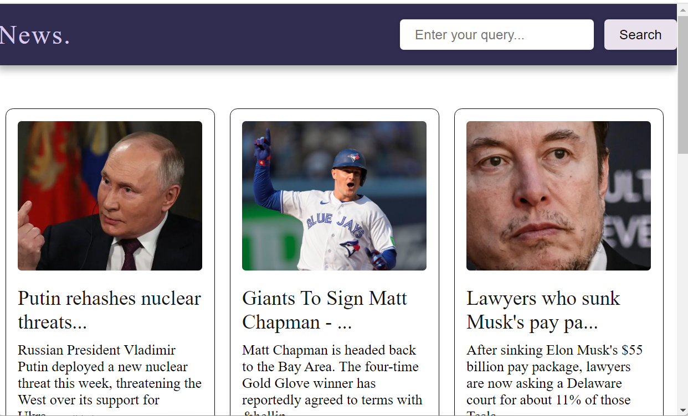
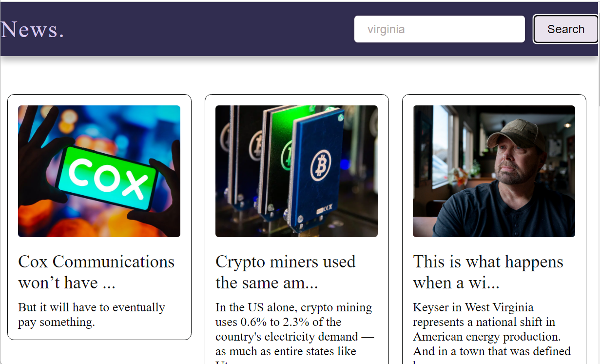

# news-api

This is a simple website that fetches news articles using the News API based on a user query.

## Table of Contents

- [Features](#features)
- [Screenshots](#screenshots)
- [Usage](#usage)
- [Setup](#setup)
- [License](#license)

## Features

- Users can enter a query to search for news articles.
- The website fetches news articles from the News API based on the user query.
- Users can read the fetched news articles directly on the website.

## Screenshots

## Usage

1. Open the website in a web browser.
2. Enter a query in the search box.
3. Press the "Search" button.
4. View the fetched news articles on the website.

## Setup

1. Clone this repository to your local machine.
2. Sign up for a free account on the [News API website](https://newsapi.org/) to get an API key.
3. Replace the placeholder API key in the code with your actual News API key.
4. Open the `index.html` file in a web browser to view the website.
   
## License

This project is licensed under the MIT License - see the [LICENSE](LICENSE) file for details.
